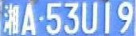
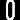
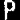
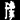
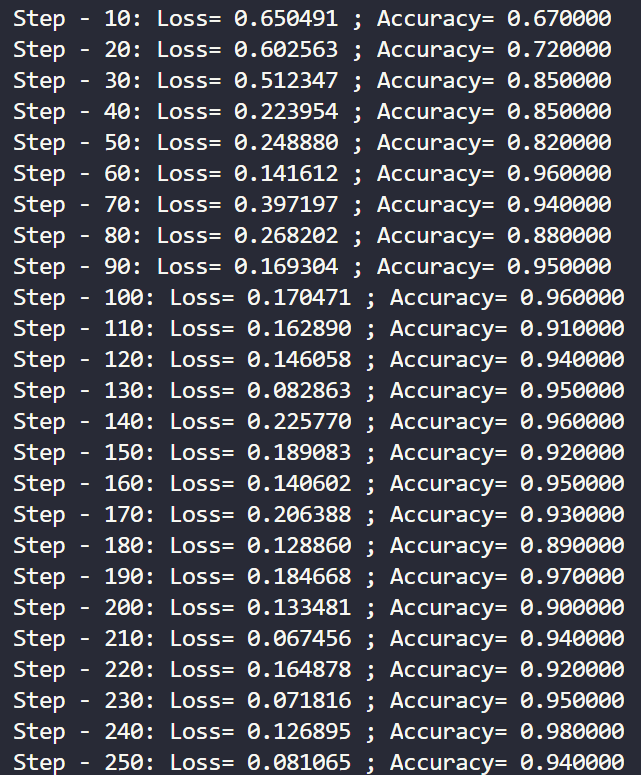
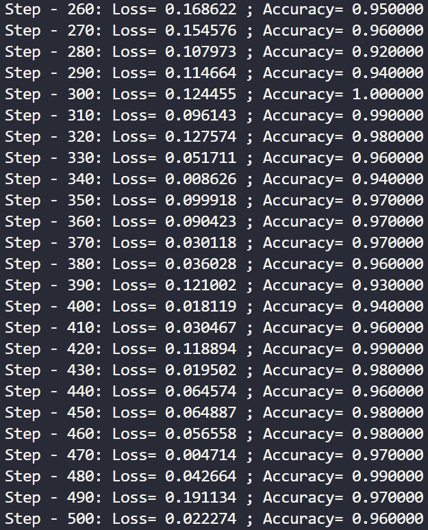
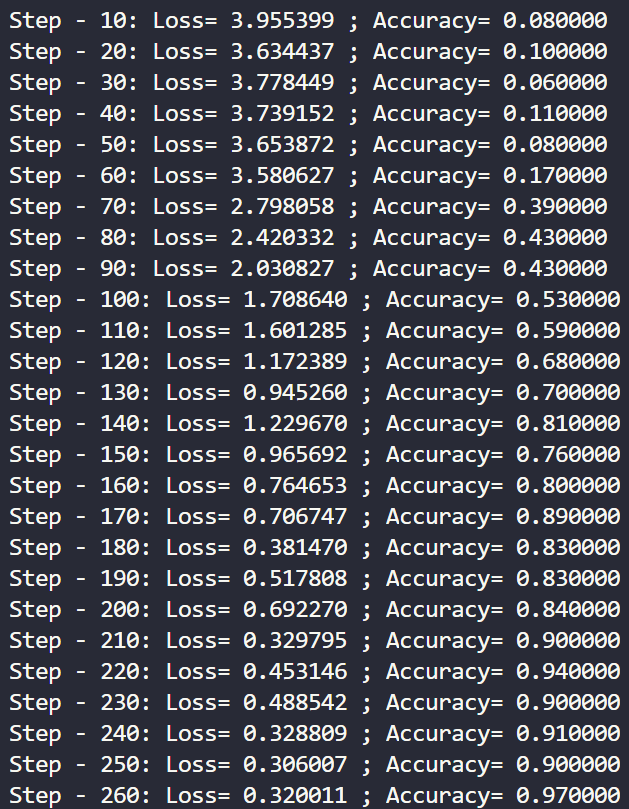
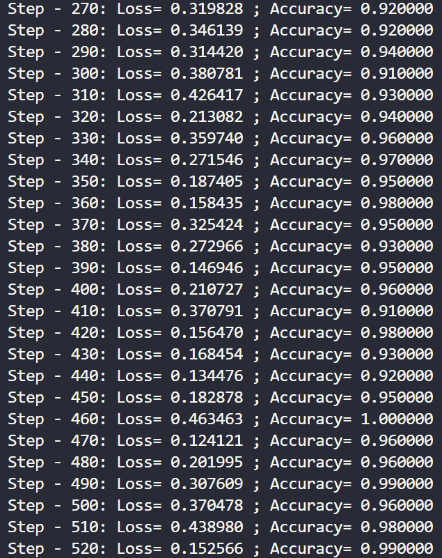

## 车牌检测及字符分割识别项目文档
---

一、项目概览
---
车牌识别在现实生活中的应用十分广泛，可以有效帮助交通管理部门获取车辆的相关信息，加强交通系统的监管。

车牌识别整体上可以分为两大部分：从图片中检测车牌以及对检测到的车牌进行字符串分割，最终获取车牌号码。借助于深度学习网络，我们可以高效地提高识别准确率，减少人工工作量。

本项目针对两个步骤构建了两个基本的CNN网络，在提供的数据集上进行训练检测。

`char-models`文件夹中存放训练得到的字符分割识别的TensorFlow模型

`license-models`文件夹中存放训练得到的车牌检测的TensorFlow模型


二、项目配置
---

### 1、开发环境
- Python 3.6
- TensorFlow 1.14

### 2、数据集详情
本项目需要构建两个CNN网络，一个用于检测图片中的车牌，另一个用于识别每一个车牌中的每一个字符。因此，本项目中的数据集也有两个。

用于检测车牌的数据集由`1916`个高为36像素，宽为136像素的车牌图片以及`3978`个同等大小的非车牌图片组成。

 

用于字符识别的数据集由`67`种字符组成，分别是从0到9的10个数字，从A到Z的26个大写英文字母，以及每个省份的汉字简称，共有`16148`张图片

  


三、项目介绍及原理
---
### 1、参考文献
>[LeCun, Y.; Bottou, L.; Bengio, Y. & Haffner, P. (1998). Gradient-based learning applied to document recognition.Proceedings of the IEEE. 86(11): 2278 - 2324.](https://ieeexplore.ieee.org/document/726791)

LetNet-5网络结构在手写数字的识别上有很高的效率，而且由于有[MNIST]()这种大型成熟数据集的存在，0~9的数字识别在现在已经成为了计算机视觉的入门问题。在LetNet-5网络中，通过其卷积层、采样层和全连接层，最终输出了对输入数字的判断。

### 2、车牌检测
为了能够更好的识别车牌上的每一个字符，我们首先需要对图片进行预处理，找到疑似“车牌”的位置，然后再使用CNN网络对这些位置进行选择判断，定位车牌。

#### 2.1、图像预处理
使用`opencv`加载图像之后，将原图像由RGB彩色图像转为灰度图像，来减少数据量：
```sh
gray_img = cv2.cvtColor(img, cv2.COLOR_BGR2GRAY)
```
之后对图像进行均值模糊处理，柔化一些较小的噪声：
```sh
blur_img = cv2.blur(gray_img, (3, 3))
```
然后使用`sobel算子`获取垂直边缘，因为车牌的垂直边缘是比较多的:
- sobel算子：主要用于获得图像的一阶梯度。利用图像中每个像素的上下左右四邻域的灰度值加权差，在边缘出达到极值从而检测边缘。sobel算子具有较好的检测效果，而且对噪声具有平滑抑制作用。
```sh
sobel_img = cv2.Sobel(blur_img, cv2.CV_16S, 1, 0, ksize=3)
sobel_img = cv2.convertScaleAbs(sobel_img)
```
之后将原始图像转为`HSV`图像，从HSV种取出蓝色、黄色区域（因为车牌背景颜色一般是蓝色或者黄色的），和soel算子处理之后的图片相乘：
- HSV色彩空间：即色相、饱和度、明度。是一种将RGB色彩模型种的点在圆柱坐标系中进行表示的方法。这个圆柱的中心轴取值为自底部黑色到顶部的白色，他们的中间部分则为灰色，绕这个轴的角度对应于色相，到这个轴的距离对应于饱和度，沿着这个轴的高度对应于亮度、色调或者明度。
```sh
hsv_img = cv2.cvtColor(img, cv2.COLOR_BGR2HSV)

h, s, v = hsv_img[:, :, 0], hsv_img[:, :, 1], hsv_img[:, :, 2]

blue_img = (((h > 26) & (h < 34)) | ((h > 100) & (h < 124))) & (s > 70) & (v > 70)
blue_img = blue_img.astype('float32')

mix_img = np.multiply(sobel_img, blue_img)
mix_img = mix_img.astype(np.uint8)
```
最后采取最大类间方差法对混合之后的图像进行二值化处理，并使用21*5大小的核将车牌的垂直边缘连成一个整体：
```sh
ret, binary_img = cv2.threshold(mix_img, 0, 255, cv2.THRESH_BINARY | cv2.THRESH_OTSU)

kernel = cv2.getStructuringElement(cv2.MORPH_RECT, (21, 5))
close_img = cv2.morphologyEx(binary_img, cv2.MORPH_CLOSE, kernel)
```

#### 2.2、车牌定位
通过上步获取到疑似车牌的轮廓之后，求出这些轮廓的外接矩形，首先通过外接矩形的长、宽、长宽比三个值排除一部分非车牌的轮廓，之后通过背景色进一步排除非车牌区域。

通过背景色排除非车牌区域时，主要用到漫水填充算法：通过在矩形区域生成种子点，种子点的颜色必须是蓝色或者黄色，在填充后的掩模上绘制外接矩形，再依次判断这个外接矩形的尺寸是否符合车牌要求，最后再把矩形做仿射变换校准位置。漫水填充的目的主要有以下两个：
- 解决在求轮廓时可能存在的轮廓残缺的问题，通过漫水算法将残缺的轮廓补全
- 进一步排除非车牌区域

#### 2.3、车牌过滤
通过上面的排除之后，会得到疑似车牌的矩形区域，之后通过训练卷积神经网络，使用模型对疑似车牌的矩形区域进行过滤，判断其是否真正是一个车牌。

##### 模型结构
- 输入层大小：136*36
- C1层：为卷积层，卷积核大小3*3，卷积核个数32，stride步长1，Same卷积，激活函数为RELU
- S1层：为max pooling层，窗口大小为2*2，stride步长为2
- C2层：为卷积层，卷积核大小3*3，卷积核个数64，stride步长1，Same卷积，激活函数为RELU
- S2层：为max pooling层，窗口大小为2*2，stride步长为2
- C3层：为卷积层，卷积核大小3*3，卷积核个数128，stride步长1，Same卷积，激活函数为RELU
- F4层：为全连接层，17\*5\*128个输入，1024个输出
- F5层：为全连接层，1024个输入，1024个输出
- F6层：为全连接层，输出一个2维向量，表示图片是否是车牌的概率

#### 模型训练结果
通过520轮训练，模型收敛，准确率为96%
 

### 3、字符分割
经过上面的处理之后，我们已经得到了较为准确的车牌区域，接下来要做的是对车牌区域进行字符分割，从水平和垂直两个方向进行分割：
- 水平投影：将二值化的车牌图片水平投影到Y轴，得到连续投影最长的一段作为字符区域，过滤掉水平方向上的连续白线。
- 垂直投影：字符与字符之间总会分隔一段距离，可以作为水平分割的依据，分割后的字符宽度必须达到平均宽度才能算作一个字符，排除车牌第2、3字符中间的“.”。


### 4、字符识别
字符识别借用MNIST手写数字识别的思路进行网络模型设计，数据集中给出了车牌信息中包含的67种字符。


#### 模型结构
本项目中的网络结构设计如下：
- 输入层大小：20*20
- C1层：卷积层，卷积核大小3*3，卷积核个数32，stride步长1，SAME卷积，使用RELU激活函数
- S1层：max pooling层，窗口大小2*2，stride步长2
- C2层：卷积层，卷积核大小3*3，卷积核个数64，stride步长1，SAME卷积，使用RELU激活函数
- S2层：max pooling层，窗口大小2*2，stride步长2
- C3层：卷积层，卷积核大小3*3，卷积核个数128，stride步长1，SAME卷积，RELU激活函数
- S3层：max pooling层，窗口大小2*2，stride步长2
- F4层：全连接层，3\*3\*128个输入，1024个输出
- F5层：全连接层，1024个输入，1024个输出
- F6层：全连接层，1024个输入，67个输出，代表分析出的概率可能值 

#### 模型训练结果
在我的训练过程中，经过520轮训练，模型便已经达到收敛，获得了99%的准确率。

 

### 5、结果输出
经过对图片中车牌的检测以及车牌上字符串的分析，最终会分割出车牌区域，并输入字符识别的最终结果，结果也会写入到`results`文件夹的`txt`文件中，文件以测试图片的名字命名。
